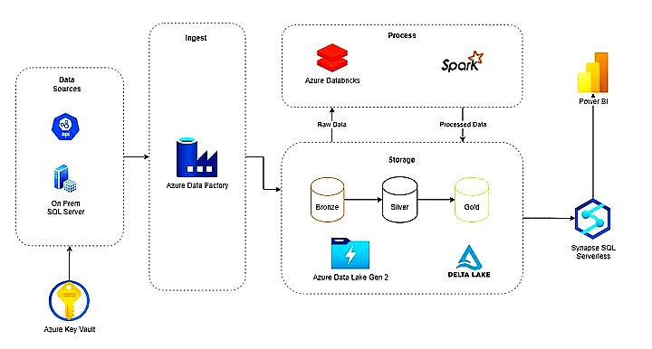

# ETL-data-processing-pipeline
End-to-End Azure ETL Pipeline using ADF, Databricks (PySpark), and ADLS for scalable data processing

## Project Overview
- Extracts data from **on-prem SQL Server** using **Azure Data Factory (ADF)**.
- Loads raw data into **Azure Data Lake Storage (ADLS)** (Bronze layer).
- Processes data using **PySpark in Azure Databricks** (Silver & Gold layers).
- Stores the final data in **Synapse SQL** for analytics and **Power BI visualization**.

## Architecture

## Running the Pipeline
- Ensure you have access to **Azure Key Vault** for credentials.
- Run the ETL script:
"data_processing_script.py"

## Technologies Used
- Azure Data Factory (ADF)
- Azure Databricks (PySpark)
- Azure Data Lake Storage (ADLS Gen2)
- Azure Synapse Analytics
- Azure Key Vault

